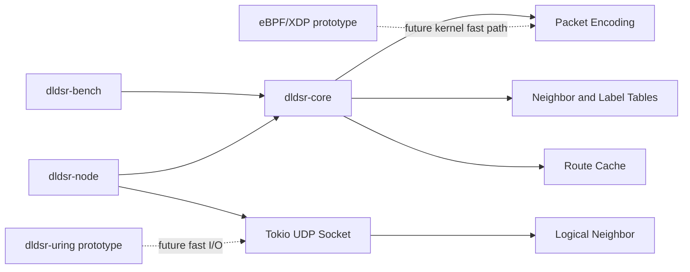

# Architecture

`dldsr-core` owns protocol data structures, metrics, topology parsing, and deterministic benchmark modeling. `dldsr-node` is the async UDP daemon. Docker Compose starts multiple node processes from one image, while each daemon only contacts logical neighbors from the topology.

